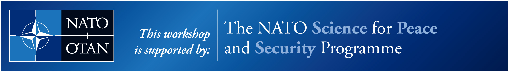

# Welcome to the AI for Disaster Management (AI4DM) GitHub Organization

This is the official GitHub organization for the **Advanced Study Institute on Artificial Intelligence for Disaster Management**, a 7-day intensive course sponsored by the **NATO Science for Peace and Security (SPS) Programme** (Grant G8054).

The event will be held from **November 17-25, 2025**, at the **University of Central Florida's Institute for Simulation and Training** in Orlando, FL, USA.

## 
About This Organization

This space serves as the central hub for all technical materials, code, datasets, and presentations related to the Advanced Study Institute. Our goal is to provide a lasting and accessible resource for all participants, both during and after the event.

Here you will find a collection of repositories dedicated to the various sessions and hands-on labs covered in the course.

## 
Key Course Themes

The curriculum is structured into two main parts, with dedicated repositories for each:

*   **Part 1: Automated Building Damage Identification**
    *   Fundamentals of Image Classification & CNNs
    *   Effective Training of Deep Learning Models
    *   Hands-on Lab: Building a Damage Classification CNN with PyTorch

*   **Part 2: Automating Flood Event Detection Using Satellite Imagery**
    *   Machine Learning Workflows for Geospatial Data
    *   Utilizing Hardware-Accelerated Tools (GPUs) for Efficient Processing
    *   Hands-on Lab: Deploying a Deep Learning Model for Flood Detection

## 
Navigating the Repositories

Each repository is named to correspond with a specific session or topic from the event programme. Inside each repository, you will find:
*   Presentation slides (PDF)
*   Jupyter Notebooks or Python scripts for hands-on labs
*   Links to relevant datasets
*   Additional learning resources and documentation

## 
Event Information & Links

*   **Official Event Website:** [https://sites.google.com/view/nato-sps-ai4dm](https://sites.google.com/view/nato-sps-ai4dm)
*   **Contact the Organizers:** For questions about the event, please email Dr. Bulent Soykan at `Bulent.Soykan@ucf.edu`.

---
*This activity is sponsored by the NATO Science for Peace and Security Programme under grant G8054.*

 